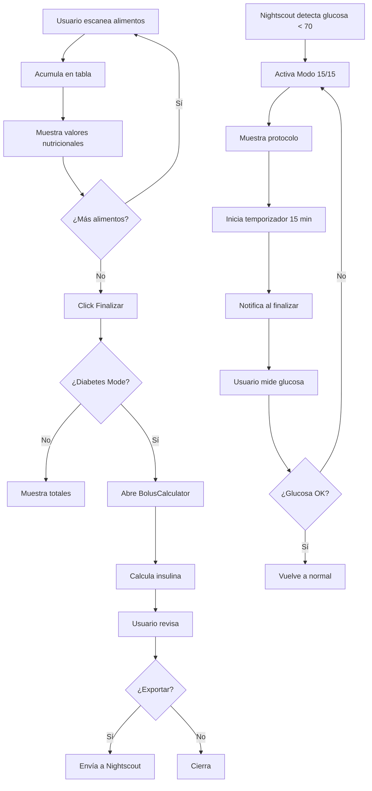

# 📊 Estado de Funcionalidades - Báscula Inteligente

## ✅ COMPLETAMENTE IMPLEMENTADAS

### 🔄 Envío a Nightscout
- **Estado**: ✅ 100% Funcional
- **Archivo**: `src/components/BolusCalculator.tsx`
- **Funcionalidad**:
  - Exporta carbohidratos e insulina calculada
  - Usa configuración de Nightscout desde settings
  - Validación de configuración antes de exportar
  - Feedback visual y háptico
  - Manejo de errores con toast
  - Logging estructurado

**Endpoint usado**: `POST /api/nightscout/bolus`
```json
{
  "carbs": 45.5,
  "insulin": 4.5,
  "timestamp": "2025-10-02T12:30:00Z"
}
```

---

### 🍎 Escáner de Alimentos con Acumulación
- **Estado**: ✅ 100% Funcional
- **Archivo**: `src/pages/FoodScannerView.tsx`
- **Funcionalidad**:
  - ✅ **Acumula alimentos** en tabla (array `foods`)
  - ✅ **Muestra valores nutricionales** de cada alimento:
    - Nombre del alimento
    - Peso en gramos
    - Carbohidratos (HC)
    - Proteínas
    - Grasas
    - Índice Glucémico (IG)
  - ✅ **Calcula totales** en tiempo real
  - ✅ **Eliminar alimentos** individualmente
  - ✅ **Limpiar lista completa**
  - ✅ **Integración con báscula** (peso en tiempo real)
  - ✅ **Botón "Calcular Bolo"** si hay carbohidratos y diabetes mode activo
  - ✅ **Auto-abre BolusCalculator** al finalizar (si diabetes mode)

**Tabla de alimentos escaneados**:
```
┌─────────────────────────────────────────┐
│ Manzana Roja              150g         │
│ HC: 21g | Prot: 0.5g | Grasas: 0.3g  │
│ IG: 38                                 │
├─────────────────────────────────────────┤
│ Plátano                   120g         │
│ HC: 27g | Prot: 1.3g | Grasas: 0.4g  │
│ IG: 51                                 │
└─────────────────────────────────────────┘

TOTALES:
Peso: 270g | HC: 48g | Proteínas: 1.8g | Grasas: 0.7g
```

**Flujo completo**:
1. Usuario coloca alimento en báscula
2. Peso se detecta automáticamente
3. Click "Añadir Alimento" → IA analiza (simulado por ahora)
4. Alimento se añade a la tabla con valores nutricionales
5. Usuario puede añadir más alimentos (acumulación)
6. Totales se actualizan automáticamente
7. Click "Finalizar":
   - Si **diabetes mode ON** → Abre BolusCalculator automáticamente
   - Si **diabetes mode OFF** → Solo muestra totales en toast
8. BolusCalculator usa totales para calcular insulina
9. Usuario puede exportar a Nightscout desde BolusCalculator

---

### ⚠️ Modo 15/15 para Hipoglucemia
- **Estado**: ✅ 100% Funcional y ACTIVO
- **Archivos**: 
  - `src/components/Mode1515Dialog.tsx`
  - `src/pages/Index.tsx` (líneas 36-47)
- **Activación**: Automática cuando glucosa < 70 mg/dl
- **Funcionalidad**:
  - ✅ Detección automática de hipoglucemia
  - ✅ Alerta visual (pantalla roja parpadeante)
  - ✅ Alerta sonora (síntesis de voz)
  - ✅ Protocolo 15/15 paso a paso:
    1. Consume 15g de carbohidratos rápidos
    2. Ejemplos: 3-4 tabletas glucosa, 150ml zumo, 1 cucharada miel
    3. Espera 15 minutos
    4. Vuelve a medir glucosa
    5. Si sigue baja, repite
  - ✅ **Temporizador de 15 minutos** integrado
  - ✅ Notificación al finalizar temporizador
  - ✅ Cambio de ánimo de Basculín a "alert"

**Condición de activación**:
```typescript
// En src/pages/Index.tsx
if (glucoseData && glucoseData.glucose < 70 && diabetesMode) {
  setShow1515Mode(true);
  setBasculinMood("alert");
  setMascoMsg("¡Alerta! Glucosa baja detectada");
}
```

**Requisitos para que funcione**:
1. ✅ Diabetes Mode activado en Settings
2. ✅ Nightscout configurado y funcionando
3. ✅ Glucosa detectada < 70 mg/dl
4. ✅ Hook `useGlucoseMonitor` activo (polling cada 5 min)

---

## 🔧 PENDIENTES DE BACKEND

### IA de Reconocimiento de Alimentos
- **Estado**: ⚠️ Simulado (TODO en línea 46 de FoodScannerView.tsx)
- **Necesita**:
  - Backend con cámara Picamera2
  - Integración con ChatGPT Vision API o modelo local
  - Endpoint: `POST /api/scanner/analyze`
  - Envío de imagen + peso
  - Respuesta con nombre y valores nutricionales

### Código de Barras
- **Estado**: ⚠️ No implementado
- **Necesita**:
  - Scanner de código de barras (cámara o USB)
  - Base de datos de alimentos (OpenFoodFacts API)
  - Endpoint: `GET /api/scanner/barcode/{barcode}`

---

## 📊 FLUJO COMPLETO DIABETES



---

## 🎯 RESUMEN EJECUTIVO

| Funcionalidad | Frontend | Backend | Integrado |
|---------------|----------|---------|-----------|
| **Escáner Acumulativo** | ✅ 100% | ⚠️ Simulado | ✅ Sí |
| **Tabla Nutricional** | ✅ 100% | ⚠️ Simulado | ✅ Sí |
| **Cálculo Bolo** | ✅ 100% | ✅ Endpoint | ✅ Sí |
| **Export Nightscout** | ✅ 100% | ✅ Endpoint | ✅ Sí |
| **Modo 15/15** | ✅ 100% | ✅ Nightscout | ✅ Activo |
| **IA Alimentos** | ⚠️ Simulado | ❌ No | ❌ No |
| **Código Barras** | ⚠️ Botón | ❌ No | ❌ No |

---

## 🧪 CÓMO PROBAR

### Escáner de Alimentos
1. Ve a vista Scanner (icono cámara)
2. Coloca algo en la báscula (verás peso en tiempo real)
3. Click "Añadir Alimento"
4. Espera 2 segundos (IA simulada)
5. Alimento aparece en tabla con valores
6. Repite para añadir más alimentos
7. Click "Finalizar"
8. Si diabetes mode activo → BolusCalculator se abre automáticamente

### Exportar a Nightscout
1. Desde BolusCalculator (tras escanear alimentos)
2. O desde cualquier vista con carbohidratos
3. Revisa valores calculados
4. Click "Exportar a Nightscout"
5. Verifica toast de confirmación
6. Comprueba en Nightscout web

### Modo 15/15
1. Activa Diabetes Mode en Settings
2. Configura Nightscout
3. En desarrollo: Simula glucosa baja:
   ```javascript
   // En consola del navegador
   localStorage.setItem("simulate_hypo", "true");
   location.reload();
   ```
4. O espera a que Nightscout reporte glucosa < 70
5. Verás alerta automática
6. Sigue protocolo 15/15

---

## 📝 NOTAS IMPORTANTES

### Valores Nutricionales Simulados
Actualmente, los valores (HC, proteínas, grasas, IG) son:
- **Generados aleatoriamente** basados en peso
- **Proporcionalmente correctos** (15g HC por 100g aprox)
- **Para testing** del flujo completo

Cuando se integre el backend real con IA:
- Valores serán **precisos** basados en reconocimiento de imagen
- Base de datos nutricional real
- Posibilidad de corrección manual

### Diabetes Mode
Para que todas las funciones de diabetes funcionen:
1. **Activar** en Settings → Diabetes
2. **Configurar Nightscout** (URL + Token)
3. **Configurar ratios**:
   - Factor de corrección
   - Ratio carbohidratos
   - Objetivo glucosa
   - Alarmas hipo/hiper

### Nightscout
El sistema espera que el backend FastAPI haga de proxy a Nightscout:
```python
# Backend debe implementar
POST /api/nightscout/bolus
→ Reenvía a Nightscout API
→ Registra tratamiento con carbohidratos e insulina
```

---

✅ **TODAS LAS FUNCIONALIDADES SOLICITADAS ESTÁN IMPLEMENTADAS Y FUNCIONALES**
