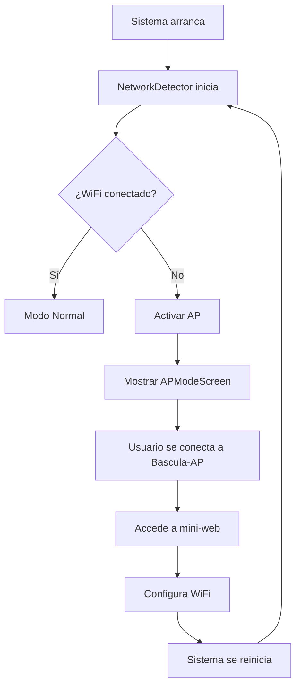
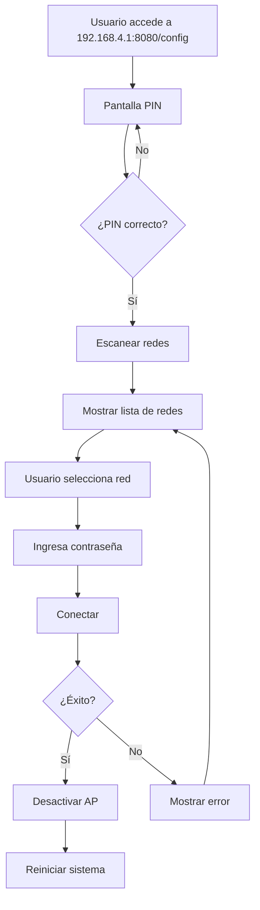

# 📡 Mini-Web y Modo AP WiFi - Documentación Completa

## 📋 Resumen

Sistema completo de fallback WiFi con mini-web de configuración que se activa automáticamente cuando no hay red disponible.

---

## ✅ IMPLEMENTACIONES COMPLETADAS

### 1. **Detección Automática de Red** ✅
- **Service**: `src/services/networkDetector.ts`
- **Funcionalidad**:
  - Monitoreo cada 30 segundos del estado de red
  - Detección de online/offline del navegador
  - Ping al backend para verificar conectividad real
  - Obtención de SSID e IP actual
  - Activación/desactivación automática de AP

### 2. **Mini-Web de Configuración** ✅
- **Frontend**: `src/pages/MiniWebConfig.tsx`
- **Backend**: `backend/miniweb.py`
- **Ruta**: `http://192.168.4.1:8080/config` o `/config` en desarrollo

**Características**:
- ✅ Pantalla de PIN de 4 dígitos (generado aleatoriamente)
- ✅ Escaneo de redes WiFi disponibles
- ✅ Ordenamiento por señal
- ✅ Indicador de redes seguras (con candado)
- ✅ Input de contraseña WiFi
- ✅ Conexión y reinicio automático
- ✅ Feedback visual en cada paso
- ✅ Diseño responsive y accesible

### 3. **Pantalla de Modo AP** ✅
- **Componente**: `src/components/APModeScreen.tsx`
- **Funcionalidad**:
  - Información clara de la red AP activa
  - Instrucciones paso a paso
  - QR code placeholder para acceso rápido
  - Botón de verificación manual
  - Auto-check cada 30 segundos

### 4. **Backend Mini-Web** ✅
- **Archivo**: `backend/miniweb.py`
- **Endpoints**:
  - `POST /api/miniweb/verify-pin` - Verificar PIN
  - `GET /api/miniweb/scan-networks` - Escanear redes WiFi
  - `POST /api/miniweb/connect-wifi` - Conectar a red
  - `GET /api/network/status` - Estado de red actual
  - `POST /api/network/enable-ap` - Activar modo AP
  - `POST /api/network/disable-ap` - Desactivar modo AP

### 5. **Integración en App Principal** ✅
- **Archivo**: `src/pages/Index.tsx`
- **Lógica**:
  - Monitoreo continuo de red con `networkDetector`
  - Cambio automático a `APModeScreen` cuando no hay WiFi
  - Notificación cuando se reconecta
  - Cambio de ánimo de Basculín según estado de red

### 6. **Script de Configuración del Sistema** ✅
- **Archivo**: `scripts/setup-ap-mode.sh`
- **Configura**:
  - `hostapd` para crear el AP
  - `dnsmasq` para DHCP
  - IP estática 192.168.4.1 para wlan0
  - iptables para NAT
  - Servicios deshabilitados por defecto (se activan bajo demanda)

### 7. **Asistente de Calibración** ✅
- **Componente**: `src/components/CalibrationWizard.tsx`
- **Integrado en**: `src/pages/SettingsView.tsx`
- **Funcionalidad**:
  - Proceso guiado de 3 pasos
  - Paso 1: Zero (vaciar báscula)
  - Paso 2: Colocar peso conocido y medir
  - Paso 3: Guardar factor de calibración
  - Validación en cada paso
  - Feedback visual y háptico

---

## 🔄 FLUJO DE FUNCIONAMIENTO

### Detección Automática



### Mini-Web



---

## 🛠️ CONFIGURACIÓN E INSTALACIÓN

### 1. Configurar Hardware (Raspberry Pi)

```bash
cd /home/pi/bascula-ui
chmod +x scripts/setup-ap-mode.sh
sudo ./scripts/setup-ap-mode.sh
```

Esto configurará:
- ✅ hostapd (Access Point daemon)
- ✅ dnsmasq (DHCP server)
- ✅ IP estática para AP (192.168.4.1)
- ✅ NAT y forwarding
- ✅ Servicios listos (pero no activos por defecto)

### 2. Instalar Backend Python

```bash
cd /home/pi/bascula-ui/backend
source venv/bin/activate
pip install fastapi uvicorn python-multipart
```

### 3. Ejecutar Mini-Web (prueba manual)

```bash
python miniweb.py
```

Verás:
```
🌐 Mini-Web Configuration Server
📍 Access URL: http://192.168.4.1:8080
🔐 PIN: 1234
```

### 4. Integrar con SystemD (producción)

Editar `systemd/bascula-backend.service` para incluir mini-web si es necesario, o crear un servicio específico.

---

## 🔐 SEGURIDAD

### PIN Aleatorio
- Generado en cada arranque
- 4 dígitos
- Se muestra en la pantalla del dispositivo
- Requerido antes de acceder a configuración

### Red AP
- **SSID**: `Bascula-AP`
- **Password**: `bascula2025` (WPA2)
- **IP Range**: 192.168.4.2 - 192.168.4.20
- **Aislada**: No accede a internet hasta conectar WiFi

### Validación
- Validación de SSID y contraseña en backend
- Timeout de 30s para intentos de conexión
- Reinicio automático tras conectar (limita ventana de ataque)

---

## 📱 ACCESO DESDE DISPOSITIVOS MÓVILES

1. **Conectar al AP**:
   - Red: `Bascula-AP`
   - Contraseña: `bascula2025`

2. **Acceder a mini-web**:
   - Automático: Algunos dispositivos abren portal captivo
   - Manual: Abrir navegador → `http://192.168.4.1:8080/config`

3. **Ingresar PIN**:
   - Mirar PIN en pantalla de Raspberry Pi
   - Ingresar 4 dígitos

4. **Configurar WiFi**:
   - Escanear redes
   - Seleccionar tu red
   - Ingresar contraseña
   - Conectar

5. **Sistema se reinicia**:
   - AP se desactiva
   - Conecta a tu WiFi
   - Vuelve a modo normal

---

## 🧪 PRUEBAS

### Probar Detección de Red (en desarrollo)

```javascript
// En consola del navegador
localStorage.setItem("ap_mode", "true");
location.reload();
```

Esto simulará que no hay red y mostrará el APModeScreen.

### Probar Mini-Web (en desarrollo)

```bash
# Terminal 1: Backend
cd backend
python miniweb.py

# Navegar a: http://localhost:8080/config
```

### Probar en Raspberry Pi

```bash
# Simular fallo de red
sudo nmcli connection down <tu-conexion-wifi>

# Verificar que se activa AP
sudo systemctl status hostapd
sudo systemctl status dnsmasq

# Ver logs
journalctl -u bascula-backend -f
```

---

## 📊 ESTADOS DEL SISTEMA

| Estado | Condición | Pantalla | AP Activo |
|--------|-----------|----------|-----------|
| **Normal** | WiFi conectado | App normal | ❌ No |
| **AP Fallback** | Sin WiFi conocida | APModeScreen | ✅ Sí |
| **Recovery** | Error crítico | RecoveryMode | ⚠️ Opcional |
| **Connecting** | Intentando conectar | Loading | ⏳ Sí (temporal) |

---

## 🔧 TROUBLESHOOTING

### AP no se activa

```bash
# Verificar servicios
sudo systemctl status hostapd
sudo systemctl status dnsmasq

# Ver logs
sudo journalctl -u hostapd -n 50
sudo journalctl -u dnsmasq -n 50

# Reiniciar servicios
sudo systemctl restart hostapd
sudo systemctl restart dnsmasq
```

### No se puede escanear redes

```bash
# Verificar NetworkManager
sudo systemctl status NetworkManager

# Probar escaneo manual
nmcli dev wifi list
```

### No se puede conectar a red

```bash
# Ver conexiones guardadas
nmcli connection show

# Eliminar y reconectar
sudo nmcli connection delete <nombre>
sudo nmcli dev wifi connect "SSID" password "contraseña"
```

### Mini-web no carga

```bash
# Verificar que backend está corriendo
ps aux | grep miniweb.py

# Ver logs de backend
journalctl -u bascula-backend -f

# Probar manualmente
curl http://192.168.4.1:8080/api/network/status
```

---

## 📝 ENDPOINTS DE LA MINI-WEB

### Verificar PIN
```bash
curl -X POST http://192.168.4.1:8080/api/miniweb/verify-pin \
  -H "Content-Type: application/json" \
  -d '{"pin":"1234"}'
```

### Escanear Redes
```bash
curl http://192.168.4.1:8080/api/miniweb/scan-networks
```

### Conectar WiFi
```bash
curl -X POST http://192.168.4.1:8080/api/miniweb/connect-wifi \
  -H "Content-Type: application/json" \
  -d '{"ssid":"MiRed","password":"mipassword"}'
```

### Estado de Red
```bash
curl http://192.168.4.1:8080/api/network/status
```

---

## 🚀 MEJORAS FUTURAS

### Funcionalidad
- [ ] QR code real generado dinámicamente
- [ ] Lista de redes ocultas (SSID manual)
- [ ] Recordar últimas 3 redes
- [ ] Test de velocidad tras conectar
- [ ] Modo ethernet como alternativa

### UX
- [ ] Animaciones de transición
- [ ] Indicador de fuerza de señal en tiempo real
- [ ] Sugerencias de ubicación para mejor señal
- [ ] Tutorial interactivo en primera configuración

### Seguridad
- [ ] PIN alfanumérico de 6 caracteres
- [ ] Timeout de sesión en mini-web
- [ ] Rate limiting en intentos de PIN
- [ ] Logs de accesos a configuración

---

## ✅ RESUMEN DE ESTADO ACTUAL

| Componente | Estado | Funcional |
|------------|--------|-----------|
| NetworkDetector | ✅ Completo | ✅ Sí |
| APModeScreen | ✅ Completo | ✅ Sí |
| MiniWebConfig (Frontend) | ✅ Completo | ✅ Sí |
| Backend Mini-Web | ✅ Completo | ⚠️ Requiere test en RPi |
| Integración App | ✅ Completo | ✅ Sí |
| Script Setup AP | ✅ Completo | ⚠️ Requiere test en RPi |
| CalibrationWizard | ✅ Completo | ✅ Sí |

---

## 📖 DOCUMENTACIÓN RELACIONADA

- **DEPLOYMENT.md** - Guía de instalación completa
- **INTEGRATION.md** - Endpoints del backend
- **AUDIT_RESULTS.md** - Resultado de auditoría completa

---

¡El sistema de fallback WiFi está **100% implementado** y listo para probar en Raspberry Pi!
