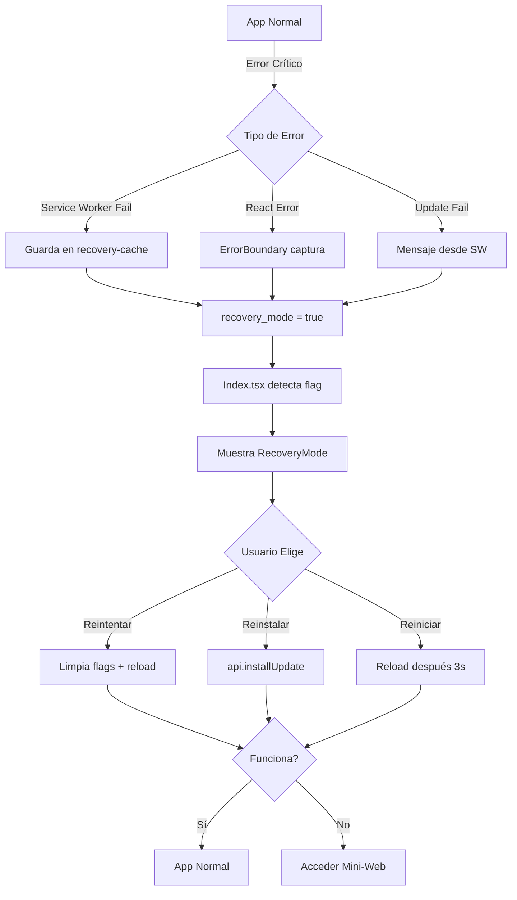

# Modo Recovery - Báscula Inteligente

## 🛡️ ¿Qué es el Modo Recovery?

El Modo Recovery es una pantalla de emergencia que se activa automáticamente cuando:
- Una actualización OTA falla durante la instalación
- El Service Worker detecta errores críticos al cachear archivos
- La aplicación React encuentra un error fatal (Error Boundary)
- Los archivos del sistema están corruptos o incompletos

## 🔄 Activación Automática

El sistema detecta fallos en múltiples niveles:

### 1. **Service Worker (public/service-worker.js)**
```javascript
// Detecta fallos durante la instalación/actualización
- Si falla cache.addAll() → Guarda flag en recovery-cache
- Envía mensaje UPDATE_FAILED a todos los clientes
- Almacena error en localStorage con timestamp
```

### 2. **Error Boundary (src/components/ErrorBoundary.tsx)**
```javascript
// Captura errores de React que causarían pantalla blanca
- componentDidCatch() → Registra error en logger
- Guarda información del error en localStorage
- Activa automáticamente el Modo Recovery
```

### 3. **Main Entry Point (src/main.tsx)**
```javascript
// Escucha mensajes del Service Worker
- Recibe UPDATE_FAILED → Activa recovery_mode
- Recibe UPDATE_SUCCESS → Limpia flags de recovery
- Verifica recovery-cache al iniciar
```

### 4. **Index Page (src/pages/Index.tsx)**
```javascript
// Verifica flag de recovery al montar
useEffect(() => {
  const isRecoveryNeeded = localStorage.getItem("recovery_mode") === "true";
  if (isRecoveryNeeded) setShowRecovery(true);
}, []);
```

## 🎯 Funcionalidades del Modo Recovery

El componente `RecoveryMode.tsx` ofrece tres opciones:

### 1. **Reintentar Cargar App** 
```typescript
- Limpia todos los flags de recovery
- Elimina errores almacenados
- Limpia recovery-cache del Service Worker
- Recarga la aplicación después de 1 segundo
```

### 2. **Reinstalar Última Versión**
```typescript
- Llama a api.installUpdate()
- Muestra toast de confirmación
- Espera 30 segundos antes de recargar
- Permite que el sistema descargue versión limpia
```

### 3. **Reiniciar Sistema**
```typescript
- Muestra mensaje de reinicio
- Recarga la aplicación después de 3 segundos
- Útil para problemas de hardware/configuración
```

## 📋 Información Mostrada

La pantalla de Recovery muestra:
- Icono de alerta prominente
- Título "Modo Recovery"
- Lista de posibles causas
- **Mensaje de error específico** (si está disponible en localStorage)
- Tres botones de acción claramente identificados
- Instrucción para acceder a mini-web desde otro dispositivo

## 🧪 Testing del Modo Recovery

### Método 1: Simular fallo de actualización
```javascript
// En la consola del navegador:
localStorage.setItem("recovery_mode", "true");
localStorage.setItem("update_error", JSON.stringify({
  error: "Failed to fetch during update",
  timestamp: new Date().toISOString()
}));
window.location.reload();
```

### Método 2: Simular error de React
```javascript
// Agrega temporalmente en cualquier componente:
throw new Error("Test recovery mode");
```

### Método 3: Forzar fallo de Service Worker
```javascript
// En service-worker.js, temporalmente cambia STATIC_ASSETS a una URL inválida:
const STATIC_ASSETS = [
  '/archivo-que-no-existe.js'
];
```

## 🔧 Recuperación Paso a Paso

1. **Usuario ve pantalla de Recovery** → Sistema detectó fallo crítico
2. **Intenta "Reintentar Cargar App"** → Si fue error temporal, se resuelve
3. **Si persiste, "Reinstalar Última Versión"** → Descarga versión limpia del servidor
4. **Si aún falla, acceder a Mini-Web** → Desde otro dispositivo: `http://192.168.4.1/config`
5. **Último recurso: "Reiniciar Sistema"** → Recarga completa del sistema

## 📦 Archivos Involucrados

```
public/service-worker.js         → Detección de fallos de actualización
src/main.tsx                     → Entry point con listeners de SW
src/App.tsx                      → Root component (envuelto en ErrorBoundary)
src/components/ErrorBoundary.tsx → Captura errores de React
src/components/RecoveryMode.tsx  → UI del modo recovery
src/pages/Index.tsx              → Verifica y muestra RecoveryMode
src/services/logger.ts           → Registra errores críticos
```

## 🚀 Integración con Otros Sistemas

### Con Sistema de Actualizaciones OTA
```typescript
// El backend puede notificar fallo de actualización vía WebSocket
// Frontend activa recovery_mode automáticamente
```

### Con Mini-Web AP Mode
```typescript
// Si Recovery falla, usuario puede:
// 1. Conectarse al WiFi AP de la báscula
// 2. Acceder a http://192.168.4.1/config
// 3. Reconfigurar conexión de red
// 4. Forzar actualización manual
```

### Con Logger Service
```typescript
// Todos los errores críticos se registran en:
localStorage.getItem("critical_errors") // Array de errores
// El usuario puede exportar logs desde Recovery Mode
```

## ⚙️ Configuración Avanzada

### Personalizar Tiempo de Espera
```typescript
// En RecoveryMode.tsx, puedes ajustar:
setTimeout(() => window.location.reload(), 30000); // 30 segundos
```

### Agregar Nuevas Acciones de Recovery
```typescript
// Ejemplo: Limpiar base de datos local
const handleClearData = async () => {
  await storage.clear();
  toast({ title: "Datos locales eliminados" });
  handleRetry();
};
```

## 🎨 Diseño Visual

El Modo Recovery usa:
- `bg-warning/5` - Fondo sutil de advertencia
- `border-warning/50` - Borde naranja para alertar
- Icono `AlertCircle` grande (20x20 con padding)
- Botones con variantes: `glow`, `secondary`, `outline`
- Cards con `max-w-2xl` para evitar que sea muy ancho

## 📊 Métricas y Monitoreo

Para producción, considera agregar:
```typescript
// Enviar telemetría cuando se activa Recovery Mode
analytics.track("recovery_mode_activated", {
  reason: lastError?.message,
  timestamp: Date.now(),
  userAgent: navigator.userAgent
});
```

## 🔒 Seguridad

- El Modo Recovery **no expone información sensible** del usuario
- Los errores mostrados son **mensajes genéricos**
- Para debug detallado, usar la mini-web con PIN de acceso
- Los logs críticos se guardan localmente, no se envían automáticamente

## 🌐 Acceso Remoto en Emergencia

Si el usuario no puede interactuar con la pantalla táctil:

1. **Conectar teclado USB** a la Raspberry Pi
2. **Presionar Ctrl+Alt+F2** → Acceder a terminal TTY
3. **Ejecutar:** `sudo systemctl restart bascula-ui`
4. **O limpiar flags manualmente:**
   ```bash
   rm -rf /home/pi/.config/chromium/Default/Local\ Storage/leveldb
   ```

## ✅ Checklist de Testing

- [ ] Forzar error en Service Worker → Recovery se activa
- [ ] Simular error de React → Error Boundary captura
- [ ] Probar "Reintentar Cargar App" → Limpia flags correctamente
- [ ] Probar "Reinstalar Última Versión" → Llama a API
- [ ] Probar "Reiniciar Sistema" → Recarga después de 3s
- [ ] Verificar que mensaje de error se muestra
- [ ] Confirmar que UPDATE_SUCCESS limpia recovery_mode
- [ ] Acceder a mini-web desde otro dispositivo

## 🔄 Flujo Completo de Recovery



---

**Nota:** Este sistema proporciona una red de seguridad robusta para que el dispositivo nunca quede completamente inoperativo, incluso después de actualizaciones fallidas o errores críticos.
